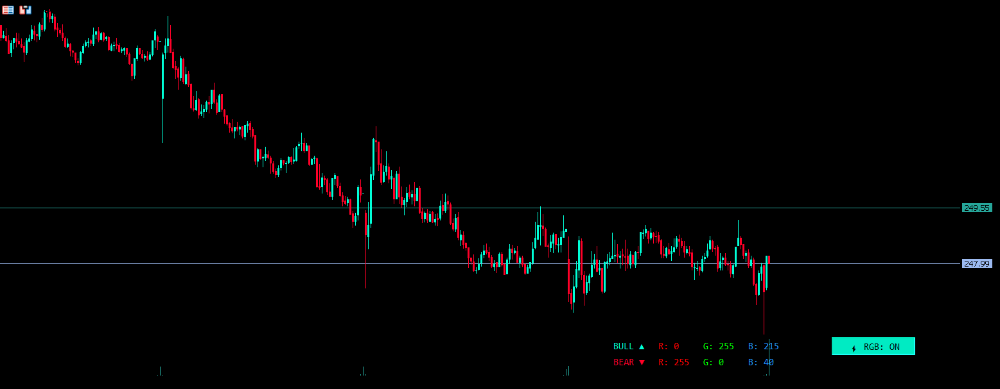
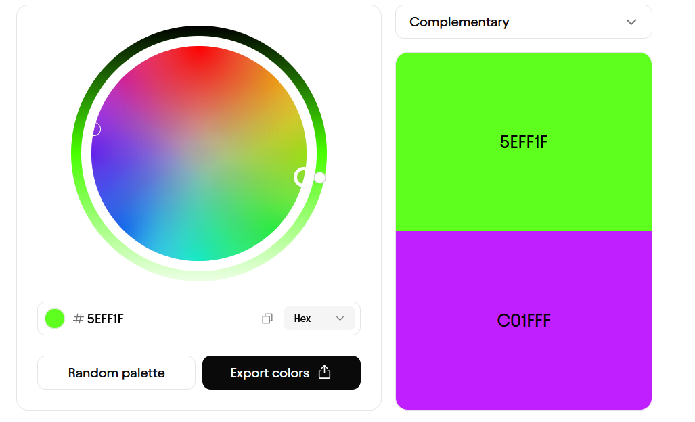

# RGB Gráfico
>"Todo será RGB y ya nada lo será" -Nadie


_Gráfico en Metatrader 5_

Este indicador gestiona la colorimetría del gráfico mediante un ciclo RGB, donde la frecuencia; milisegundos, y el paso de la cantidad de saltos dictan la transición. Incluye un monitor en tiempo real de los valores para las velas alcistas y las bajistas, al igual que un botón de control de estado.

```mql5
      case 0: G += PasoColor; if(G >= 255) { G = 255; FASE = 1; } break; //--- Rojo lleno, sube verde y va a fase 1
      case 1: R -= PasoColor; if(R <= 0)   { R = 0;   FASE = 2; } break; //--- Verde lleno, baja rojo y va a fase 2
      case 2: B += PasoColor; if(B >= 255) { B = 255; FASE = 3; } break; //--- Solo verde, sube azul y va a fase 3
      case 3: G -= PasoColor; if(G <= 0)   { G = 0;   FASE = 4; } break; //--- Azul lleno, baja verde y va a fase 4
      case 4: R += PasoColor; if(R >= 255) { R = 255; FASE = 5; } break; //--- Solo azul, sube rojo y va a fase 5
      case 5: B -= PasoColor; if(B <= 0)   { B = 0;   FASE = 0; } break; //--- Rojo lleno, baja azul y regresa a fase 0
```
El proceso es una reacción en cadena, inicia en rojo puro (255,0,0). Incrementa el verde hasta su máximo, momento en el que el rojo inicia su decremento hacia cero. Esto se repite de manera cíclica (fase a fase), asegurando que siempre interactúen únicamente dos colores a la vez, evitando tonos grisáceos o blancos.
```mql5
//--- Crea un tipo de texto y convierte dicho texto en un color real ---\\
   color ColorBull = StringToColor(StringFormat("%d,%d,%d", R, G, B));
   color ColorBear = StringToColor(StringFormat("%d,%d,%d", 255-R, 255-G, 255-B));
```
Para que las velas alcistas y las bajistas tengan los valores invertidos y poder convertirlos en algo que pueda ser interpretado como un color, fue necesario convertirlo a string con un formato especifico y después que este a su vez se convirtiera en un formato de colores, para invertir los colores basta con restar 255 a cada uno de los colores y quedan invertidos, ya que mientras las alcistas son (255,0,0) las bajistas son (0,255,255).


_Representación visual de la inversión de colores_


